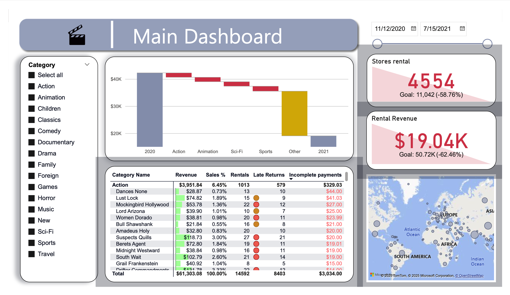
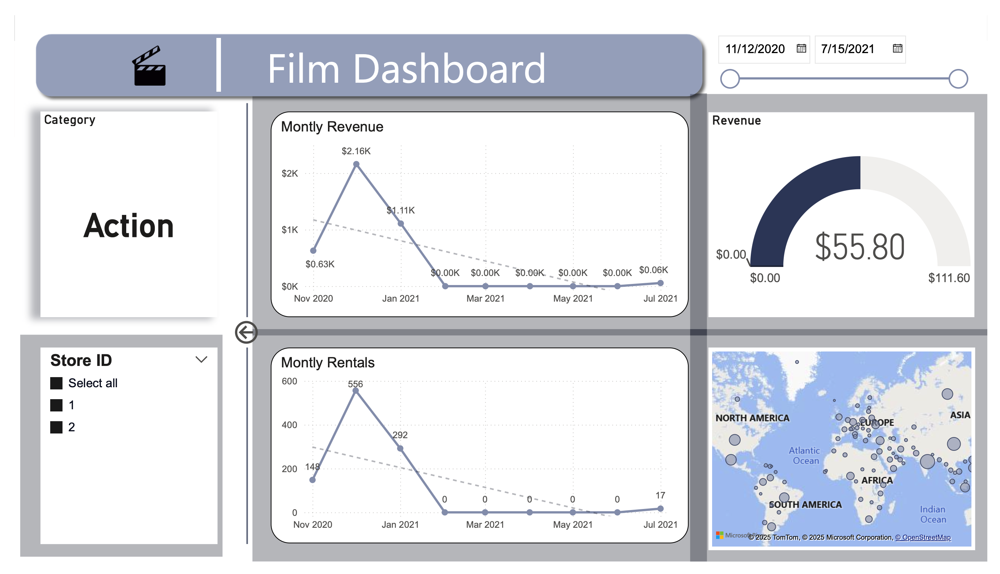
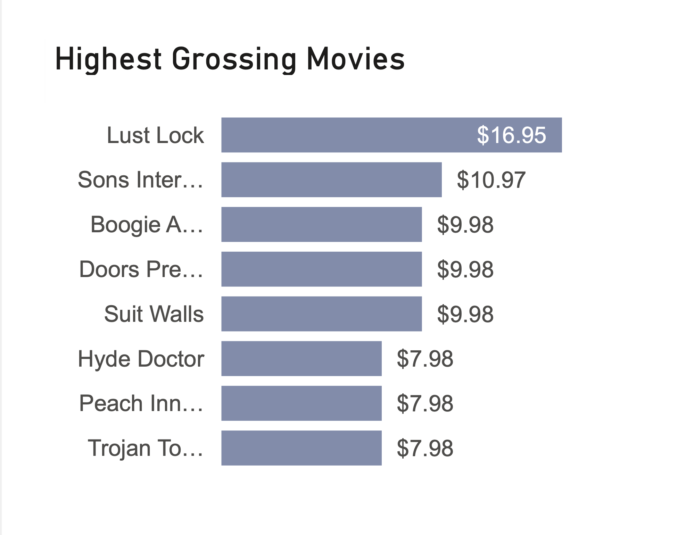

# Sakila Rental Analytics - Power BI

Interactive Power BI project analyzing the Sakila movie rental dataset.  
Includes star schema modeling, Power Query transformations, DAX measures & KPIs, and two tailored dashboards (executive overview & category drill-through) for revenue, rentals, late returns, and unpaid fees insights.

---

## 📂 How to Open and Use the Files

### Files in this repository:
- **sakila-movie-rental-powerbi-dashboard.pbix** – Open with **Power BI Desktop**. Contains the full data model, DAX measures, KPIs, and dashboards.
- **/screenshots/** – PNG images of key dashboard views (Main Dashboard, Film Dashboard, Matrix View).  
  These are embedded in this README for quick preview.
- **README.md** – Full project documentation (this file).
- **LICENSE** – License terms for using the project.

### Steps to view the project:
1. Download the `.pbix` file from this repository.
2. Open it with **Power BI Desktop**.
3. If prompted for a data source, connect to the **Sakila** database or use the embedded model.
4. Navigate between the **Main Dashboard** and **Film Dashboard** tabs.
5. Interact with slicers, drill through for category details, and hover over tooltips for additional insights.

---

## 📊 Overview

Interactive analytics solution for a film rental business using the **Sakila** schema.  
The project demonstrates solid **data modeling**, **Power Query transformations**, **DAX calculated columns and measures**, and two audience-tailored **dashboards** for fast decision making.

**Contributors:** Ran Chaim, Ilay Haviv, Gabriel Mizrahi  
**Modeling approach:** **Star Schema**. Data shaping via Power Query plus DAX where appropriate.  

---

## 🎯 Objectives
- Clean and model raw operational tables into a star schema suitable for analytics.  
- Enrich the data with behavioral flags and business logic.  
- Build KPIs and visuals that surface revenue, rental volume, late returns, and unpaid replacement exposure.  
- Provide an executive **Main Dashboard** and a focused **Film Dashboard** with drill-through.  

---

## 🛠 Data Prep and Modeling

### Transformations in Power Query
- Data types normalized and columns renamed for clarity.
- Removed low-value or constant columns such as `Month abbreviation` and `last_update`.
- Date formatting aligned to assignment requirements.
- Text hygiene: lowercase or CapitalCase, `NULL` replaced with `NA`, extracted `user_name` from email prefix.

### Calculated Columns (DAX unless noted)
- **level_of_income**: binned `annual_income` into 3 bands to emulate SQL NTILE, then labeled Low, Medium, High.  
- **is_weekend**: 1 if day of week > 5, else 0, based on rental date.  
- **late_return**: 1 if not returned or returned late, else 0.  
- **rental_complete_payment**: flag amount unpaid for replacement when item not returned.  
- **rental_number**: label string `"OR"` + `rental_id`.

> **Rationale:** Use Power Query for shaping and DAX for model-level logic and relationships.

---

## 📏 Measures and KPI Design

All measures live under table **MSR**, organized into folders:  

- **Dates**: `Min Date`, `Max Date` to drive report period filters.  
- **KPI**:  
  - `Last Year Rental`, `Last Month Rental`  
  - `Revenue Last Month`, `Revenue Last Year`  
  - `Revenue MTD Last Month` for Gauge target on Film Dashboard  
  > KPI targets are intentionally set to **110%** of prior period to enforce stretch goals.  
- **Rentals**: Current month rental count.  
- **Sales Percentages**: Share by category and by film within category.  
- **Totals**: Rentals, late returns, payments.  

---

## 📊 Dashboards

### 1) Main Dashboard — Executive overview
- **KPIs**: YoY and MoM comparisons. Chosen YoY anchor due to a known data pause in Feb 2021 - Jun 2021; category filters do not affect KPI cards.  
- **Waterfall**: Revenue by category at year level using `year_begin_date` to align with annual KPIs.  
- **Matrix**:  
  - Revenue per film with data bars and a no-rental icon.  
  - Sales share metrics: category share and film-within-category share.  
  - Rentals count, late returns count.  
  - Conditional icons for late returns: yellow from 5, red from 10.  
  - Conditional formatting in red when `rental_complete_payment` > 0 to expose unpaid replacement risk.  
- **Map**: Revenue by country using proportional markers.  

### 2) Film Dashboard — Category detail and drill-through
- Accessed via **Drill Through** from Main; time filter synchronized.  
- Store selector to split or combine stores.  
- **Line charts**: Monthly revenue and rentals by `month_begin_date` using `Revenue` and `Total Rentals`.  
- **Gauge**: Monthly revenue vs last month target with tooltip listing top 8 films.  
- **Map**: Same as Main but scoped to selected category.  

---

## 📸 Screenshots

### Main Dashboard

### Film Dashboard

### Highest Grossing Movies View

---

## 📈 Business Insights surfaced
- Visibility into unpaid replacement amounts for non-returned items.  
- Identification of late-return heavy titles using threshold icons to prompt policy changes.  
- Category and title level revenue concentration and mix.  

---

## 📂 Repository Structure

├─ sakila-movie-rental-powerbi-dashboard.pbix
├─ README.md
├─ LICENSE
└─ screenshots/
├─ main-dashboard.png
├─ film-dashboard.png
└─ highest-grossing-movies.png

> **Tip:** Use PNG for GitHub rendering; add concise alt text and captions.

---

## ▶️ How to Run
1. Open `sakila-movie-rental-powerbi-dashboard.pbix` with **Power BI Desktop**.
2. If prompted for a source, point to your local **Sakila** database or accept the embedded model if present.
3. Interact with slicers, drill through from Main to Film, and hover the Gauge to see top 8 films.

---

## 📝 Notes and Lessons
- Prefer **Transform Data** for shaping; reserve DAX for model logic and relationships.  
- Use variables and reuse measures to keep the model clean.  
- Separate executive vs operational views into distinct dashboards.  

---

## 🙏 Acknowledgments
Built as a collaborative assignment by **Ran Chaim, Ilay Haviv, Gabriel Mizrahi**.
